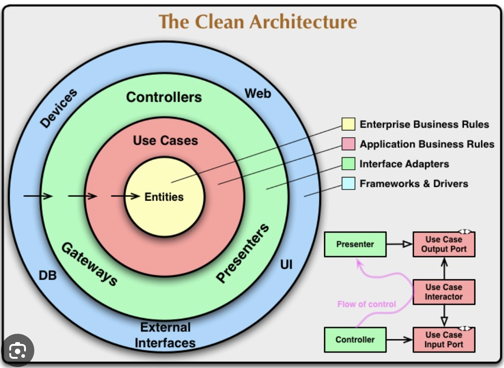

# Folio (Clean Architecture Sample Project)

[](https://github.com/castmart/Folio/actions/workflows/test.yaml)

Sample project using Clean Architecture. This project is a sample ticket generator system. Which covers the use cases: 

 - As Worker Create a new Ticket
 - As Worker or Customer track ticket status
 - As Worker update Ticket
 - As Worker or Costumer view all the Ticket info.

Beyond the functionality, it is important to concentrate on the project structure and code implementation. 
One key motivation of this exercise is to show how to implement such Architecture using Spring boot, which most of 
the time is used to construct layered architected applications (either by package or by module).

In this project I try to follow the principles exposed in the Clean Architecture Book from Bob Martin.
Where it is claimed **"a good architecture is the one that delays the details' implementation"**.

One advantage of using this architecture is that we can easily apply IoC by using interfaces in the core module and implementing them only in
the Details module. This way it is respected that ONLY lower level components should be aware of Higher level components. And at the same time,
as Bob Martin states, the dependencies in this architecture should point inward (see Figure 1).



The structure of the project is based on gradle submodules which will help separating the "Policy" of the Application 
(Entities, Business and Application Rules) from the "details" (Frameworks, I/O devices and Databases).

Application Sub-modules:
- **Core**: Here we define the use cases (enterprise rules and business rules). For convenience here we also define the "Interface adapters".

- **Details**: Here are defined he entry points and the data providers (f.e. HTTP handlers and DB)

- **Configuration**: In this modules we have all the configuration code that wires everything together.

Tests Sub-modules:
- **integration-tests**: This module only contain tests for the repositories and entrypoints.


To go one step ahead, this project structure will help support two different types of Web Stacks in spring boot, the classical
Web Servlet Stack and the Reactive Stack. This way, it can be proved that the election on technologies can be delayed following this
Architectural principles.


## Phase 1. Use RestControllers and JdbcTemplate

### Test Strategy
- We make unit tests for core and details subprojects.
  - This will use kotest and mokk to keep it simple but more adapted to the language.
  - To run these tests: `make unit-tests`
- We create another subproject called integration-tests just to execute the integration tests.
  - Here it will be used kotest and TestContainers.
  - To run these tests: `make integration-tests`
- Finally, end-to-end tests will live in the configuration sub-project because it is the part of the system that wires everything up.
  - Here it will be used TestContainers to create the DB.
  - We will rely on Mock MVC (this in not properly e2e but is used for convenience)
  - To run these tests: `make e2e-tests`

### How to run the Application

1. Run the local database with  `docker-compose up`
2. Execute the spring boot app with `./gradlew bootRun`
3. To create a ticket execute the curl command: 
``` bash 
curl -X PUT http://localhost:8080/ticket/v1 -H 'Content-Type: application/json' -d '{"id":"93BB0038-CB9D-433F-B830-FA627DE32F76", "ticketNumber":"1", "ownerName": "Juan", "ownerEmail":"email", "ownerPhoneNumber": "01", "shoeDescription": "A shoe", "completionDate": "2023-12-31T00:00:00.000+0200", "status": "IN_PROGRESS" }'
```
4. To get the ticket: 
```bash 
curl http://localhost:8080/ticket/v1/[ticket id]
```
5. To update the ticket: 
``` bash
curl -X POST http://localhost:8080/ticket/v1 -H 'Content-Type: application/json' -d '{"id":"d669e186-4c10-4d4b-bd28-9d8edc2a4508", "ticketNumber":"2", "ownerName": "Juan", "ownerEmail":"email", "ownerPhoneNumber": "01", "shoeDescription": "A shoe", "completionDate": "2024-12-31T00:00:00.000+0200", "status": "IN_PROGRESS" }'
```

## Phase 2. Use Functional Endpoints

Now, let's suppose that your team wants to change the technology that is using for exposing the http api endpoints. 
From the well known Spring mvc Annotated controllers from the phase 1 to the new Functional Endpoints offered by the same
mvc project (see [docs](https://docs.spring.io/spring-framework/reference/web/webmvc-functional.html) here).

For the clean Architecture this is considered a detail, then all the new code should only affect the code in the `details` sun-project. 
To do that, it has been added a new class that will be the handler of the endpoints (which will be configured in the `configuration` sub-project).

```kotlin
// Handler function in "details" sub-project.
class TicketRestEntrypointHandlerV1 {
  fun getTicketById(request: ServerRequest): ServerResponse
  fun createTicket(request: ServerRequest): ServerResponse
  fun updateTicket(request: ServerRequest): ServerResponse
}
```

```kotlin
// Wiring up handler functions and routes in "configuration" sub-project.
@Configuration
class FunctionalEntrypointBeans {

  @Bean
  fun functionalHandler(
    getUseCase: GetATicketUseCase,
    createTicketUseCase: CreateTicketUseCase,
    updateTicketUseCase: UpdateTicketUseCase,
  ): TicketRestEntrypointHandlerV1 {
    return TicketRestEntrypointHandlerV1(createTicketUseCase, updateTicketUseCase, getUseCase)
  }

  @Bean
  fun router(handler: TicketRestEntrypointHandlerV1): RouterFunction<ServerResponse> {
    return router {
      GET("/fun/ticket/v1/{ticketId}", handler::getTicketById)
      accept(MediaType.APPLICATION_JSON).nest {
        PUT("/fun/ticket/v1", handler::createTicket)
        POST("/fun/ticket/v1", handler::createTicket)
      }
    }
  }
}
```
### How to test the functional endpoints

1. Run the local database with  `docker-compose up`
2. Execute the spring boot app with `./gradlew bootRun`
3. To create a ticket execute the curl command:
``` bash 
curl -X PUT http://localhost:8080/fun/ticket/v1 -H 'Content-Type: application/json' -d '{"id":"93BB0038-CB9D-433F-B830-FA627DE32F76", "ticketNumber":"1", "ownerName": "Juan", "ownerEmail":"email", "ownerPhoneNumber": "01", "shoeDescription": "A shoe", "completionDate": "2023-12-31T00:00:00.000+0200", "status": "IN_PROGRESS" }'
```
4. To get the ticket:
```bash 
curl http://localhost:8080/fun/ticket/v1/[ticket id]
```
5. To update the ticket:
``` bash
curl -X POST http://localhost:8080/fun/ticket/v1 -H 'Content-Type: application/json' -d '{"id":"d669e186-4c10-4d4b-bd28-9d8edc2a4508", "ticketNumber":"2", "ownerName": "Juan", "ownerEmail":"email", "ownerPhoneNumber": "01", "shoeDescription": "A shoe", "completionDate": "2024-12-31T00:00:00.000+0200", "status": "IN_PROGRESS" }'
```

### Spring Functional endpoints 


#### Phase 3. Use Reactive Stack
#### Phase 4. Use JPA